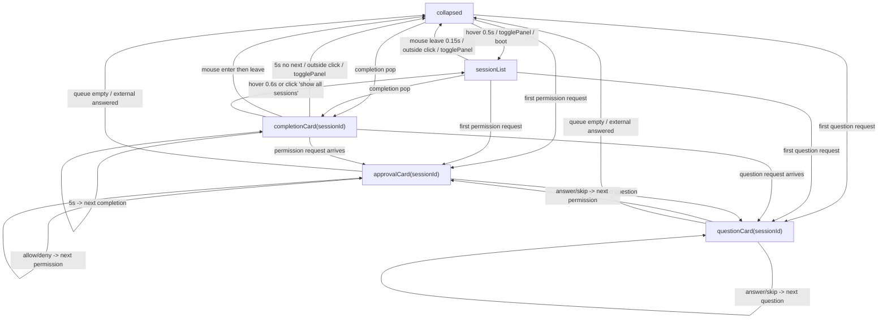
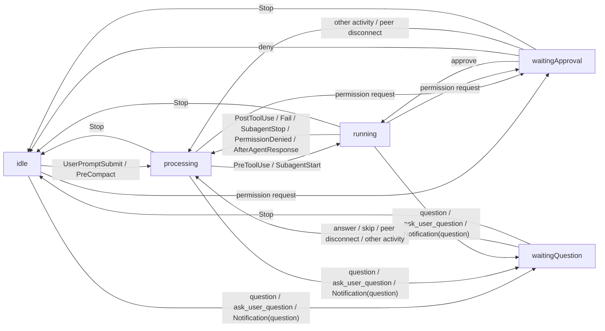

# Island 状态机与尺寸说明

> 基于当前实现整理，覆盖 `IslandSurface`、`AgentStatus`、尺寸规则、显隐条件与鼠标/事件驱动的状态切换。

## 1. 总览

CodeIsland 的 “Island 状态” 实际上由两层正交状态组成：

- **Surface（外壳展示面，5 种）**：决定当前 Island 展示的是收起条、会话列表、审批卡、问答卡还是完成卡。
- **AgentStatus（会话/汇总状态，5 种）**：决定当前活跃会话处于空闲、处理中、工具运行中、等待审批还是等待提问。

此外还有一个**窗口可见性覆盖层**：在全屏隐藏或“无会话时隐藏”开启时，面板会直接 `orderOut`，这不属于上述 10 个状态之一。

## 2. Surface 状态机（5）

### Surface 状态说明

| 状态 | 含义 | 展示内容 | 典型进入方式 |
| --- | --- | --- | --- |
| `collapsed` | 收起态 | 刘海层 compact bar | 默认、mouse leave、处理完队列 |
| `sessionList` | 普通展开态 | 全量 session 列表 | hover 展开、快捷键展开 |
| `approvalCard(sessionId)` | 审批态 | 权限请求卡片 | 收到首个权限请求 |
| `questionCard(sessionId)` | 问答态 | 问题 + 选项/输入框 | 收到首个阻塞问题 |
| `completionCard(sessionId)` | 完成态 | 单个完成 session 卡片 | `Stop` 事件触发 completion |

## 3. AgentStatus 状态机（5）

### 汇总优先级

多会话并存时，compact bar 的汇总状态优先级如下：

`waitingApproval > waitingQuestion > running > processing > idle`

这会影响：

- compact bar 左侧角色的状态动画
- compact bar 右侧是否显示铃铛
- `primarySource` 取哪个 CLI/source
- `activeSessionCount` 是否大于 0

## 4. 尺寸规则

### 4.1 顶层窗口尺寸

| 项目 | 规则 |
| --- | --- |
| 面板最大宽度 | `min(620, screenWidth - 40)` |
| 面板最大高度 | `max(300, maxVisibleSessions * 90 + 60)` |
| 默认 `maxVisibleSessions` | `5` |
| 默认最大高度 | `510pt` |

### 4.2 顶部刘海层尺寸

| 项目 | 规则 |
| --- | --- |
| `notchHeight` | 优先取 `safeAreaInsets.top`，否则取菜单栏高度 |
| 典型刘海屏 `notchHeight` | 约 `37pt` |
| 典型非刘海屏 `notchHeight` | 约 `25pt` |
| `notchW`（刘海屏） | 真实刘海宽度 |
| `notchW`（非刘海屏） | 固定为 `110pt` |
| `mascotSize` | `min(27, notchHeight - 6)` |
| `compactWingWidth` | `mascotSize + 14` |

### 4.3 视觉宽度规则

记：

- `wing = compactWingWidth`
- `expandedWidth = min(max(notchW + 200, 580), min(620, screenWidth - 40))`

| 视觉态 | 宽度 |
| --- | --- |
| 无会话，idle indicator，未 hover | `notchW + 2 * wing` |
| 无会话，idle indicator，hover | `notchW + 2 * wing + 80` |
| 有会话，`collapsed`，汇总 `idle` | `notchW + 2 * wing` |
| 有会话，`collapsed`，汇总非 `idle` | `notchW + 2 * wing + 20` |
| `sessionList` / `approvalCard` / `questionCard` / `completionCard` | `expandedWidth` |

### 4.4 列表高度预算

| 项目 | 规则 |
| --- | --- |
| 单张 session 卡高度预算 | 约 `90pt` |
| 滚动阈值 | `maxVisibleSessions * 90` |
| 默认滚动阈值 | `450pt` |

> 备注：当前设置里虽然有 `maxPanelHeight`，但布局代码尚未实际使用该值。

## 5. 鼠标与事件驱动规则

### 5.1 Hover / Mouse Leave

| 场景 | 行为 |
| --- | --- |
| hover 到收起态 island | 延迟 `0.5s` 后展开到 `sessionList` |
| 鼠标移出普通展开态 | 延迟 `0.15s` 后收起到 `collapsed` |
| `approvalCard` / `questionCard` | 不走 hover 自动收起逻辑 |
| `completionCard` | 必须先 hover 进入过一次，之后离开才允许收起 |
| idle indicator hover | 仅做自身左右扩展，不切到 `sessionList` |

### 5.2 Click / Select

| 场景 | 行为 |
| --- | --- |
| 首次点击面板 | 直接命中，不会先被窗口激活吞掉 |
| 展开态点击面板外 | 收起到 `collapsed` |
| `approvalCard` / `questionCard` 时点面板外 | 忽略，不自动关闭 |
| `completionCard` 的 session 卡 | 整张卡可点击跳转到终端/IDE |
| 普通 `sessionList` 卡片 | 主要通过右侧跳转按钮跳转 |
| 项目名 | 点击打开项目目录 |
| `ALL / STA / CLI` | 切换分组模式，有明确选中态 |
| Question 选项行 | hover 高亮，点击即提交答案 |

> 备注：Question 选项行内部虽然记录了 `selectedIndex`，但当前没有额外的持久选中视觉样式，主要是 hover 态与点击提交。

### 5.3 快捷键与队列

| 触发源 | 影响 |
| --- | --- |
| `togglePanel` | 在 `collapsed` 与 `sessionList` 间切换 |
| 首个权限请求入队 | 切到 `approvalCard` |
| 首个问题入队 | 切到 `questionCard` |
| 队列处理完成 | 若无剩余 pending，收起到 `collapsed` |
| `Stop` 事件 | 触发 completion queue，展示 `completionCard` |
| completion 5 秒超时 | 展示下一个 completion，或收起 |

### 5.4 抑制与隐藏

| 条件 | 结果 |
| --- | --- |
| `smartSuppress = true` 且 active session 终端在前台 | hover 不自动展开 |
| completion 对应 session tab 当前可见 | completion 不弹出 |
| `hideInFullscreen = true` 且当前空间全屏 | 面板 `orderOut` |
| `hideWhenNoSession = true` 且 `activeSessionCount == 0` | 面板 `orderOut` |

## 6. 源码入口

- `Sources/CodeIsland/IslandSurface.swift`
- `Sources/CodeIsland/AppState.swift`
- `Sources/CodeIsland/NotchPanelView.swift`
- `Sources/CodeIsland/PanelWindowController.swift`
- `Sources/CodeIsland/ScreenDetector.swift`
- `Sources/CodeIslandCore/Models.swift`
- `Sources/CodeIslandCore/SessionSnapshot.swift`
